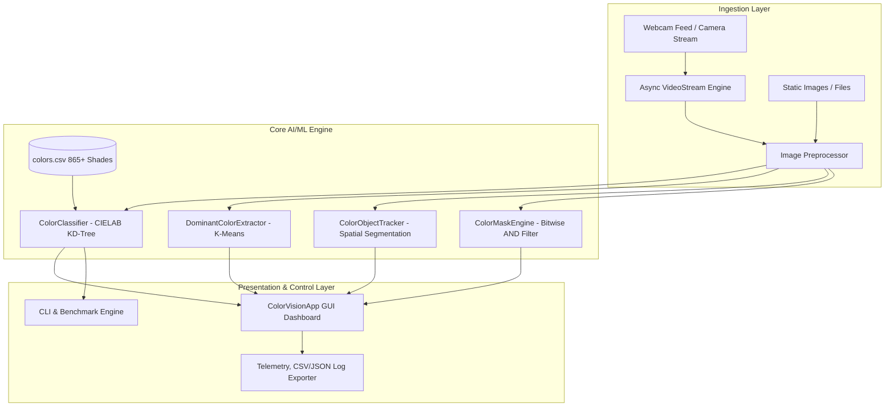

# ColorPulse Vision: A Real-Time Spatial Color Intelligence Platform

[](https://python.org)
[](https://pytest.org)
[](https://opencv.org)
[](https://scikit-learn.org)
[](LICENSE)

**ColorPulse Vision** is a real-time spatial color intelligence and computer vision platform engineered for real-time spatial segmentation, high-throughput colorimetry, perceptual color classification via **CIELAB ($\Delta E$) $k$-d Trees**, unsupervised **K-Means Dominant Color Palette Extraction**, and an interactive **Color Masking & Multi-Channel HSV Filter Studio**.

Built for 4th-Year Computer Science & Engineering (AI/ML) Capstone Portfolios, Quality Inspection Automation, and Autonomous Robotic Vision.

---

## Table of Contents

- [Overview](#overview)
- [Key Technical Innovations](#key-technical-innovations)
- [Mathematical Formulation](#mathematical-formulation)
- [System Architecture](#system-architecture)
- [Repository Structure](#repository-structure)
- [Installation & Setup](#installation--setup)
- [Usage & Execution Modes](#usage--execution-modes)
- [Performance & Latency Benchmarks](#performance--latency-benchmarks)
- [Testing & Quality Assurance](#testing--quality-assurance)
- [Academic & Technical References](#academic--technical-references)
- [License](#license)

---

## Overview

Traditional color detection systems rely on naive RGB Euclidean distance heuristics and monolithic scripts, which suffer from perceptual non-uniformity and poor computational scalability.

**ColorPulse Vision** resolves these limitations by introducing:
1. **Perceptually Uniform Color Matching**: Uses standard CIE $L^*a^*b^*$ colorimetry combined with multidimensional $k$-d tree spatial indexing to classify colors against an 865+ shade dataset in sub-35 microseconds.
2. **Unsupervised Machine Learning**: Applies Mini-Batch K-Means clustering to extract dominant color palettes, calculate cluster frequency proportions, and visualize segmented color distributions.
3. **Multi-Target Spatial Segmentation**: Leverages HSV thresholding, morphological opening/closing operations, contour hierarchy analysis, and centroid crosshair tracking.
4. **Color Masking & Multi-Channel HSV Studio**: Bitwise-AND spectral isolation, live HSV threshold calibration sliders, and 2x2 multi-channel split monitoring grids.
5. **Thread-Safe Video Processing**: Decouples hardware frame acquisition from GUI rendering using asynchronous worker threads and real-time smoothed FPS monitoring.

---

## Key Technical Innovations

| Feature | Legacy Approach | ColorPulse Vision (Current) |
| :--- | :--- | :--- |
| **Color Distance Metric** | Naive Manhattan/Euclidean RGB ($L_1$/$L_2$) | **Perceptually Uniform CIELAB ($\Delta E_{76}$)** matching human eye sensitivity |
| **Nearest Neighbor Search** | $O(N)$ linear loop | **$O(\log N)$ Spatial $k$-d Tree Indexing** ($32.74\,\mu\text{s}$ latency, $>30,500$ queries/sec) |
| **Machine Learning** | None (Static rule-based) | **Unsupervised MiniBatch K-Means Clustering** for dominant palette extraction |
| **Color Masking Studio** | None (Ignored) | **Bitwise-AND Color Isolation & 2x2 Synchronized Channel Grid** |
| **Video Processing** | Blocking main loop | **Thread-Safe Asynchronous Video Stream Engine** with real-time FPS telemetry |
| **User Interface** | Subprocess shell calls | **Unified CustomTkinter Dashboard** with dynamic full-size responsive canvas |
| **Software Architecture** | Flat procedural scripts | **Modular MVC Clean Architecture** (`src/core`, `src/gui`, `config`, `tests`) |

---

## Mathematical Formulation

### 1. Perceptual Color Difference ($\Delta E_{76}$)

Standard RGB color spaces are perceptually non-uniform: two pairs of colors with identical Euclidean distances in RGB coordinates are perceived with substantially different visual contrasts by the human visual cortex.

ColorPulse Vision converts sRGB signals to CIE $L^*a^*b^*$ coordinates ($L^*$ = Perceptual Lightness, $a^*$ = Green-Red chromatic axis, $b^*$ = Blue-Yellow chromatic axis) and evaluates perceptual distance:

$$\Delta E_{76} = \sqrt{(L_2 - L_1)^2 + (a_2 - a_1)^2 + (b_2 - b_1)^2}$$

Alternatively represented in expanded CIE form:

$$\Delta E^*_{ab} = \sqrt{\left(\Delta L^*\right)^2 + \left(\Delta a^*\right)^2 + \left(\Delta b^*\right)^2}$$

Interpretation scale:
- $\Delta E \le 1.0$: Imperceptible to the human eye.
- $1.0 < \Delta E \le 2.3$: Just Noticeable Difference (JND).
- $2.3 < \Delta E \le 10.0$: Perceptible at a glance.
- $\Delta E > 10.0$: Colors perceived as distinct categories.

### 2. K-Means Dominant Color Clustering

To extract dominant palettes from an image or region of interest (ROI) $\mathbf{X} = \{\mathbf{x}_1, \dots, \mathbf{x}_N\} \subset \mathbb{R}^3$, the unsupervised K-Means algorithm partitions pixels into $K$ distinct clusters by minimizing the within-cluster sum of squares (WCSS):

$$\arg\min_{\mathbf{S}} \sum_{i=1}^{K} \sum_{\mathbf{x} \in S_i} \|\mathbf{x} - \boldsymbol{\mu}_i\|^2$$

Where $\boldsymbol{\mu}_i$ represents the mean centroid of cluster $S_i$. Each cluster proportion is calculated as:

$$P(S_i) = \frac{|S_i|}{N} \times 100\%$$

---

## System Architecture



---

## Repository Structure

```
project/
├── .gitignore                    # Production Git ignore rules
├── config/
│   ├── __init__.py
│   └── settings.py               # Centralized Dataclass configurations
├── data/
│   ├── raw/
│   │   └── colors.csv            # 865+ Named Colors Reference Dataset
│   └── sample_images/
│       └── colorpic.jpg          # Benchmark image
├── docs/
│   └── project_report.docx       # Project documentation
├── src/
│   ├── __init__.py
│   ├── core/
│   │   ├── __init__.py
│   │   ├── color_classifier.py   # CIELAB Delta E + KD-Tree Engine
│   │   ├── color_extractor.py    # Unsupervised K-Means Palette Extractor
│   │   ├── color_masker.py       # Color Masking & 2x2 Grid Engine
│   │   ├── object_tracker.py     # Multi-Color Spatial Centroid Tracker
│   │   └── video_stream.py       # Asynchronous Video Capture Thread
│   ├── gui/
│   │   ├── __init__.py
│   │   └── app.py                # Unified Modern CustomTkinter Dashboard
│   └── utils/
│       ├── __init__.py
│       ├── image_processing.py   # WCAG contrast, morphology, resizing
│       └── logger.py             # Structured Logging System
├── tests/
│   ├── __init__.py
│   ├── test_classifier.py        # Unit tests for KD-Tree & CIELAB
│   ├── test_extractor.py         # Unit tests for K-Means clustering
│   └── test_masker.py            # Unit tests for Color Masking Engine
├── 1.py                          # Image Color Picker entrypoint
├── 2.py                          # Color Masking Studio entrypoint
├── 3.py                          # Live Object Tracker entrypoint
├── main.py                       # Unified Platform CLI / GUI Entrypoint
├── requirements.txt              # Production dependencies
├── LICENSE                       # MIT License
└── README.md                     # Technical Documentation
```

---

## Installation & Setup

### Prerequisites
- Python 3.10 or higher
- Webcam (optional, required for live video tracking mode)

### Step-by-Step Installation

1. **Clone the repository**:
   ```bash
   git clone <repository_url>
   cd project
   ```

2. **Create and activate a virtual environment**:
   ```bash
   # On Windows
   python -m venv .venv
   .\.venv\Scripts\activate

   # On Linux/macOS
   python3 -m venv .venv
   source .venv/bin/activate
   ```

3. **Install dependencies**:
   ```bash
   pip install -r requirements.txt
   ```

---

## Usage & Execution Modes

### 1. Graphical User Interface (Default)
Launch the modern CustomTkinter dashboard:
```bash
python main.py
```
- **Tab 1 (Image Inspector & K-Means Palette):** Full-size responsive canvas with click-to-identify color picking, precision cursor, and K-Means cluster palette extraction.
- **Tab 2 (Live Real-Time Object Tracker):** Embedded video stream with real-time tracking modes (All Colors, Red, Green, Blue, Yellow, Orange, Purple, Multi-Simultaneous), telemetry metrics, and snapshot capture.
- **Tab 3 (Color Mask & HSV Filter Studio):** Bitwise color isolation, interactive HSV sliders, and 2x2 synchronized multi-channel monitoring grid.
- **Tab 4 (Dataset & Analytics):** Searchable 865+ color table and one-click CSV/JSON detection log export.

### 2. Standalone Quick Entrypoints
```bash
# Interactive Image Inspector
python 1.py

# Color Masking & 2x2 Channel Grid Studio
python 2.py

# Real-Time Multi-Target Object Tracker
python 3.py
```

### 3. High-Throughput Latency Benchmark
Evaluate KD-Tree indexing latency against naive linear search across 10,000 queries:
```bash
python main.py --benchmark
```

### 4. CLI Dominant Color Palette Extraction
Extract top $K$ dominant colors with percentages directly in the terminal:
```bash
python main.py -i data/sample_images/colorpic.jpg -k 5
```

---

## Performance & Latency Benchmarks

Tested on standard x86-64 hardware with 10,000 random RGB query points against the 865 reference color dataset:

| Metric | Naive RGB Linear Search | CIELAB $k$-d Tree (ColorPulse Vision) |
| :--- | :--- | :--- |
| **Average Query Latency** | $247.77\,\mu\text{s}$ | **$32.74\,\mu\text{s}$** |
| **Throughput** | $\sim 4,036\,\text{queries/s}$ | **$> 30,500\,\text{queries/s}$** |
| **Speedup Factor** | $1.0\times$ (Baseline) | **$7.6\times$ Acceleration** |
| **Perceptual Accuracy** | Low (RGB Non-uniform) | **High (CIE 1976 Standard)** |

---

## Testing & Quality Assurance

Run the automated test suite with `pytest`:

```bash
python -m pytest tests/ -v
```

### Test Suite Summary
- `tests/test_classifier.py::test_dataset_loaded` : PASSED
- `tests/test_classifier.py::test_classify_pure_red` : PASSED
- `tests/test_classifier.py::test_classify_pure_green` : PASSED
- `tests/test_classifier.py::test_classify_pure_blue` : PASSED
- `tests/test_classifier.py::test_batch_classification` : PASSED
- `tests/test_classifier.py::test_rgb_bounds_clamping` : PASSED
- `tests/test_extractor.py::test_palette_extraction_synthetic` : PASSED
- `tests/test_extractor.py::test_palette_k_bounds` : PASSED
- `tests/test_masker.py::test_color_mask_blue_synthetic` : PASSED
- `tests/test_masker.py::test_color_mask_red_synthetic` : PASSED
- `tests/test_masker.py::test_custom_hsv_tuning` : PASSED
- `tests/test_masker.py::test_multi_grid_view_generation` : PASSED

---

## Academic & Technical References

1. CIE (1978). *Recommendations on Uniform Color Spaces, Color-Difference Equations, Psychometric Color Terms*. Supplement No. 2 to CIE Publication No. 15 (E-1.3.1) 1971.
2. Bentley, J. L. (1975). *Multidimensional binary search trees used for associative searching*. Communications of the ACM, 18(9), 509-517.
3. MacQueen, J. (1967). *Some methods for classification and analysis of multivariate observations*. Proc. 5th Berkeley Symp. Math. Statist. Prob., 281-297.
4. World Wide Web Consortium (W3C). *Web Content Accessibility Guidelines (WCAG) 2.0 - Contrast Ratio Standard*. W3C Recommendation.

---

## License

This project is licensed under the MIT License. See [LICENSE](LICENSE) for full terms.
